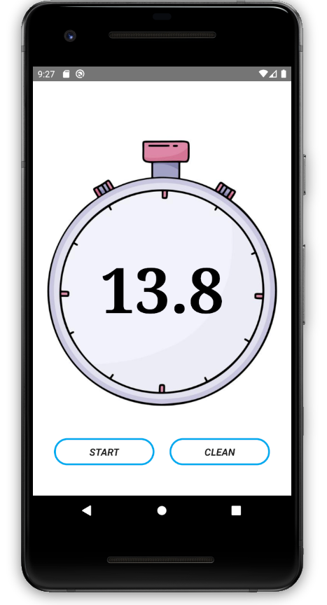

# Aplicativo de Cronômetro

Um aplicativo de cronômetro simples desenvolvido em React Native.

## Funcionalidades

- Iniciar e pausar o cronômetro
- Reiniciar o cronômetro

## Requisitos de Instalação

- Node.js (v14 ou superior)
- npm ou yarn
- React Native CLI
- Dispositivo ou emulador iOS/Android

## Como Executar o Aplicativo

1. Clone este repositório:

   > git clone https://github.com/jeffersontavaresdm/chonometer-app.git
2. Acesse o diretório do projeto:

   > cd chonometer-app
3. Instale as dependências:

   > npm install
4. Execute o aplicativo no dispositivo ou emulador:

   Para IOS:

   > npx react-native run-ios

   Para Android:
   > npx react-native run-android

## Contribuição
Contribuições são bem-vindas! Se você quiser contribuir para este projeto, siga as etapas abaixo:

* Faça um fork do repositório.
* Crie uma branch com a sua feature ou correção de bug: git checkout -b minha-contribuicao.
* Faça as alterações necessárias e faça commit das mudanças: git commit -m 'Minha contribuição'
* Envie as alterações para o seu fork: git push origin minha-contribuicao
* Abra um Pull Request no repositório original
* Certifique-se de seguir nossas diretrizes de contribuição e de respeitar o código de conduta.
